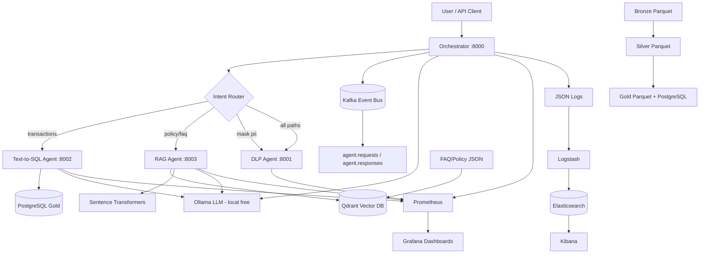
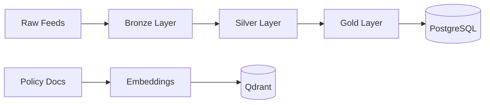

# System Architecture

## High-Level Diagram

## Medallion Data Flow

## Request Lifecycle

1. User sends message to `POST /chat`
2. **DLP Agent** masks PII in the user message (hard filter)
3. **Router** classifies intent (keyword rules + optional Ollama)
4. Event published to **Kafka** (`agent.requests`)
5. Appropriate agent handles the request
6. Response published to **Kafka** (`agent.responses`)
7. Structured JSON logs flow to **ELK**; metrics to **Prometheus/Grafana**

## Security Layers

| Layer | Mechanism |
|-------|-----------|
| Input | DLP regex masking + hard block |
| SQL | SELECT-only validation, sqlparse |
| DB | `agent_readonly` role, RLS enabled |
| Output | Column masking for PAN/account in results |
| Schema | Aliased column names in LLM prompts |
