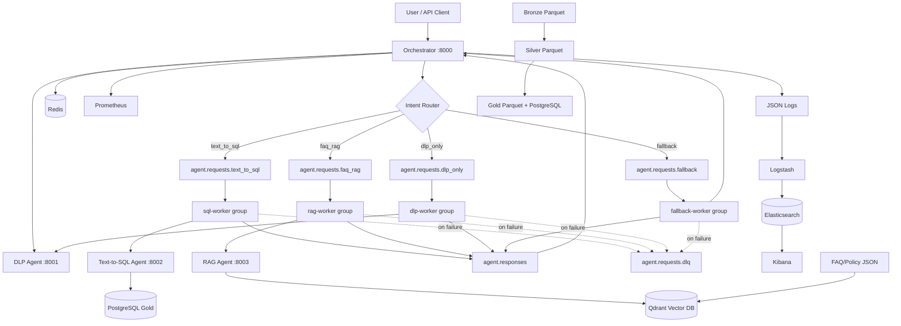
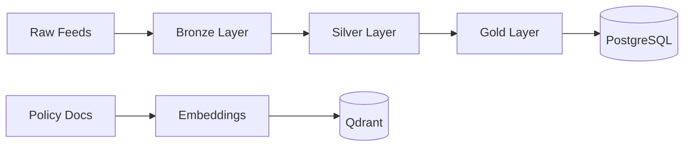

# System Architecture

## High-Level Diagram



## Kafka Topic Design

| Topic | Partitions | Producer | Consumer group |
|-------|------------|----------|----------------|
| `agent.requests.text_to_sql` | 3 | Orchestrator | `sql-worker-group` |
| `agent.requests.faq_rag` | 3 | Orchestrator | `rag-worker-group` |
| `agent.requests.dlp_only` | 2 | Orchestrator | `dlp-worker-group` |
| `agent.requests.fallback` | 1 | Orchestrator | `fallback-worker-group` |
| `agent.responses` | 6 | All workers | Orchestrator (unique group per instance) |
| `agent.requests.dlq` | 1 | Workers (on failure) | Manual inspection |

- **Partition key:** `correlation_id` on every publish
- **Topic creation:** `scripts/init_kafka_topics.sh` via `kafka-init` service
- **Auto-create:** disabled — topics must be provisioned explicitly

See [KAFKA_GUIDE.md](KAFKA_GUIDE.md) for hands-on labs.

## Medallion Data Flow



## Request Lifecycle

1. User sends `POST /chat` with optional `X-Correlation-ID`
2. **Redis** rate-limit check (`ratelimit:chat:{client_id}`)
3. **DLP Agent** masks PII (hard block on sensitive content)
4. **Router** classifies intent (keywords + optional Ollama)
5. **Redis** cache lookup for SQL/RAG queries
6. Orchestrator publishes to **intent-specific Kafka topic** (key = `correlation_id`)
7. **Intent worker** consumes, calls agent over HTTP, retries up to 3×
8. Worker publishes `agent.response` to **`agent.responses`** (or **DLQ** on failure)
9. Orchestrator receives response, caches in Redis, returns to user
10. JSON logs → ELK; metrics → Prometheus/Grafana

## Redis Responsibilities

| Key pattern | Purpose |
|-------------|---------|
| `ratelimit:chat:{client_id}` | 30 req/min per client |
| `cache:response:{hash}` | Cached SQL/RAG answers (5 min TTL) |
| `req:state:{correlation_id}` | `pending` / `completed` during Kafka flow |

## Security Layers

| Layer | Mechanism |
|-------|-----------|
| Input | DLP regex masking + hard block |
| Rate limit | Redis per-client throttling |
| SQL | SELECT-only validation, sqlparse |
| DB | `agent_readonly` role, RLS enabled |
| Output | Column masking for PAN/account in results |
| Schema | Aliased column names in LLM prompts |
| Kafka | DLQ for poison messages |

## Scaling

```powershell
# Scale SQL workers to match partition count (max 3 parallel)
docker compose up -d --scale sql-worker=3

# Scale RAG workers (max 3 parallel)
docker compose up -d --scale rag-worker=2
```

## Study Map

- **Every file explained:** [FILE_GUIDE.md](FILE_GUIDE.md)
- **Kafka deep dive:** [KAFKA_GUIDE.md](KAFKA_GUIDE.md)
- **Week-by-week checklist:** [BUILD_CHECKLIST.md](BUILD_CHECKLIST.md)
