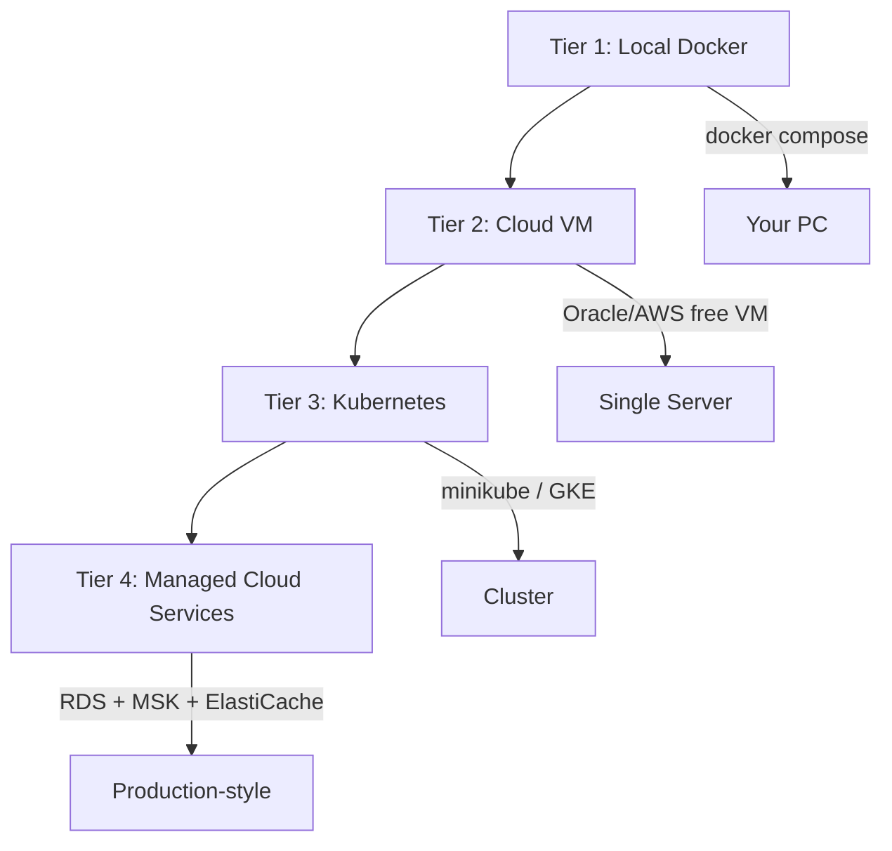
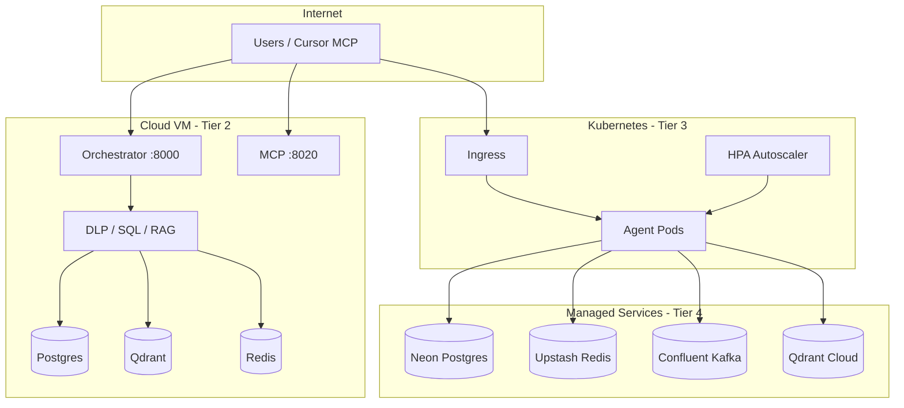

# Cloud Deployment & Integration Guide

Learn how to deploy this project from **your laptop** → **cloud VM** → **Kubernetes** → **managed cloud services**.

---

## Deployment Tiers (Pick Your Learning Path)



| Tier | Best for | RAM needed | Files |
|------|----------|------------|-------|
| **1 — Local** | Daily dev | 8GB+ (full) / 4GB (lite) | `docker-compose.yml`, `docker-compose.lite.yml` |
| **2 — Cloud VM** | Public demo, portfolio | 4GB VM | `docker-compose.cloud.yml` |
| **3 — Kubernetes** | Scaling, probes, HPA | 8GB+ local cluster | `k8s/` |
| **4 — Managed** | Production patterns | Varies | Env vars + external URLs |

---

## Tier 1 — Local Docker (You Already Have This)

```powershell
# Full stack (Kafka, Redis, ELK)
docker compose up -d --build

# Lite (no Kafka/ELK)
docker compose -f docker-compose.lite.yml up -d --build

# Init data
docker compose --profile init run --rm data-init
```

---

## Tier 2 — Cloud VM (Free Tier Friendly)

Best options for learning (free or cheap):

| Provider | Free offering | Notes |
|----------|---------------|-------|
| **Oracle Cloud** | Always-free ARM VM (4 OCPU, 24GB RAM) | Best free option |
| **AWS** | EC2 t3.micro 12 months | 1GB RAM — use lite compose only |
| **Google Cloud** | e2-micro always-free | Tight on RAM |
| **Azure** | B1s 12 months | OK for cloud compose |

### Step-by-step: Oracle Cloud VM

**1. Create VM**
- Ubuntu 22.04 or 24.04
- Shape: VM.Standard.A1.Flex (ARM, free tier)
- Open ports in **Security List / NSG**: `22`, `8000`, `8020`

**2. SSH and bootstrap**
```bash
git clone https://github.com/KranthiYadavE/Financial_MultiAgent.git
cd Financial_MultiAgent
chmod +x deploy/vm/setup-ubuntu.sh
./deploy/vm/setup-ubuntu.sh
# Log out and back in for docker group
```

**3. Configure and deploy**
```bash
cp deploy/cloud/.env.cloud.example .env
nano .env   # set POSTGRES_PASSWORD
docker compose -f docker-compose.cloud.yml up -d --build
docker compose -f docker-compose.cloud.yml --profile init run --rm data-init
```

**4. Test from your PC**
```powershell
curl http://YOUR_VM_PUBLIC_IP:8000/health
curl -X POST http://YOUR_VM_PUBLIC_IP:8000/chat -H "Content-Type: application/json" -d "{\"message\":\"Show my last 3 transactions\"}"
```

**5. Optional: install Ollama on VM**
```bash
curl -fsSL https://ollama.com/install.sh | sh
ollama pull llama3.2:3b
```

### What `docker-compose.cloud.yml` includes

- Postgres, Qdrant, Redis
- DLP, Text-to-SQL, RAG agents
- Orchestrator (port 8000)
- MCP server (port 8020)
- **No Kafka/ELK** — fits 4GB RAM VMs

---

## Tier 3 — Kubernetes

### 3A. Local cluster (minikube — learn K8s free)

```powershell
# Install minikube: https://minikube.sigs.k8s.io/docs/start/
minikube start --memory=8192 --cpus=4
minikube addons enable ingress
minikube addons enable metrics-server

# Build images into minikube (or pull from GHCR after CI push)
minikube docker-env   # PowerShell: minikube -p minikube docker-env | Invoke-Expression
./deploy/scripts/build-images.ps1

# Deploy
kubectl apply -k k8s/

# Check pods
kubectl get pods -n financial-agents
kubectl get svc -n financial-agents

# Access orchestrator
minikube service orchestrator -n financial-agents --url
```

Add to hosts file: `$(minikube ip) financial-agents.local`  
Then: `http://financial-agents.local/` via Ingress

### 3B. kind (alternative local K8s)

```bash
kind create cluster --name financial-agents
kind load docker-image ghcr.io/kranthiyadave/financial-multiagent/orchestrator:latest --name financial-agents
kubectl apply -k k8s/
```

### 3C. K8s manifests in this repo

| File | What it deploys |
|------|-----------------|
| `namespace.yaml` | `financial-agents` namespace |
| `configmap.yaml` | Non-secret env config |
| `secret.example.yaml` | DB passwords (copy & edit) |
| `redis-deployment.yaml` | Redis cache |
| `dlp-agent-deployment.yaml` | DLP service |
| `text-to-sql-deployment.yaml` | SQL agent |
| `rag-agent-deployment.yaml` | RAG agent |
| `orchestrator-deployment.yaml` | API gateway (LoadBalancer) |
| `sql-worker-deployment.yaml` | Kafka SQL worker (2 replicas) |
| `mcp-server-deployment.yaml` | MCP HTTP server |
| `ingress.yaml` | Route traffic to orchestrator + MCP |
| `hpa-orchestrator.yaml` | Auto-scale orchestrator 2→6 pods |
| `kustomization.yaml` | Apply everything with one command |

```bash
kubectl apply -k k8s/
```

### 3D. GKE / EKS / AKS (managed Kubernetes)

**Learning exercise** — same manifests, different cluster:

1. Create a small cluster (GKE Autopilot trial, EKS free tier control plane)
2. Push images to GHCR (see Tier 3E)
3. Update image names in `k8s/` if your GHCR path differs
4. `kubectl apply -k k8s/`
5. Use cloud LoadBalancer or Ingress + cert-manager for HTTPS

---

## Tier 3E — Container Registry (GHCR) + CI/CD

### Build and push images locally

```powershell
./deploy/scripts/build-images.ps1
docker login ghcr.io -u YOUR_GITHUB_USERNAME
./deploy/scripts/push-images.ps1
```

### GitHub Actions (automatic on push to `main`)

Workflow: `.github/workflows/docker-publish.yml`

- Builds all 6 service images
- Pushes to `ghcr.io/YOUR_USERNAME/financial-multiagent/*`

**Enable:** GitHub repo → Settings → Actions → General → allow workflows  
**Pull in K8s:** set `imagePullPolicy: Always` and use your GHCR path

---

## Tier 4 — Managed Cloud Services (Production Patterns)

Replace self-hosted components with managed services via **environment variables only** — no code changes needed.

### Service mapping

| Self-hosted (local) | AWS | GCP | Azure | Free-tier alternative |
|---------------------|-----|-----|-------|----------------------|
| PostgreSQL | RDS PostgreSQL | Cloud SQL | Azure Database | [Neon](https://neon.tech), [Supabase](https://supabase.com) |
| Redis | ElastiCache | Memorystore | Azure Cache | [Upstash](https://upstash.com) free tier |
| Kafka | Amazon MSK | Pub/Sub* | Event Hubs | [Confluent Cloud](https://confluent.io/confluent-cloud/) trial |
| Qdrant | — | — | — | [Qdrant Cloud](https://cloud.qdrant.io) free cluster |
| Logs | CloudWatch | Cloud Logging | Monitor | Keep ELK local or use Grafana Cloud free |
| LLM | Bedrock | Vertex AI | Azure OpenAI | Ollama on VM (free) |

\* GCP Pub/Sub is different from Kafka — use Confluent Cloud or MSK for Kafka protocol.

### Example: Neon Postgres + Upstash Redis on cloud VM

Edit `.env` on your VM:

```env
POSTGRES_HOST=ep-xxxx.us-east-1.aws.neon.tech
POSTGRES_PORT=5432
POSTGRES_USER=finagent
POSTGRES_PASSWORD=neon_secret
POSTGRES_DB=financial_gold

REDIS_HOST=xxxx.upstash.io
REDIS_PORT=6379
REDIS_PASSWORD=upstash_token
```

Run only app containers (no local postgres/redis) — advanced exercise: create `docker-compose.cloud-managed.yml`.

### Example: Confluent Cloud Kafka

```env
KAFKA_BOOTSTRAP_SERVERS=pkc-xxxx.region.aws.confluent.cloud:9092
# Add SASL_SSL config in kafka_bus.py as learning exercise
```

---

## Cloud Architecture Diagram



---

## Security Checklist (Before Public Deploy)

- [ ] Change `POSTGRES_PASSWORD` from default
- [ ] Do not commit `.env` or `k8s/secret.example.yaml` with real secrets
- [ ] Use `kubectl create secret` instead of plain YAML in production
- [ ] Restrict firewall to your IP if demo-only
- [ ] Add HTTPS (nginx + Let's Encrypt or cloud LoadBalancer TLS)
- [ ] Rate limiting is on via Redis (`REDIS_RATE_LIMIT_PER_MINUTE`)

---

## Learning Labs

### Lab 1: Deploy to Oracle free VM (2 hours)
Follow Tier 2 steps; call API from your phone browser.

### Lab 2: minikube deploy (1 hour)
`kubectl apply -k k8s/` and hit orchestrator via `minikube service`.

### Lab 3: GHCR + CI (30 min)
Push to GitHub `main`; watch Actions build images; pull in K8s.

### Lab 4: HPA stress test (30 min)
```bash
kubectl autoscale deployment orchestrator --cpu-percent=50 --min=2 --max=5 -n financial-agents
# or use k8s/hpa-orchestrator.yaml
kubectl run -i --tty load-generator --rm --image=busybox --restart=Never -- /bin/sh
```

### Lab 5: Managed Postgres (1 hour)
Create Neon free DB; update `.env`; run `load_to_postgres.py` against Neon host.

---

## Troubleshooting

| Problem | Fix |
|---------|-----|
| VM out of memory | Use `docker-compose.cloud.yml` not full compose |
| Can't reach :8000 | Open cloud firewall / security group |
| K8s ImagePullBackOff | Build locally into minikube or push to GHCR |
| Ollama unreachable | Install on VM or set `OLLAMA_BASE_URL` to remote |
| Kafka on small VM | Use `KAFKA_BOOTSTRAP_SERVERS=disabled` (direct HTTP fallback) |

---

## Files Reference

| Path | Purpose |
|------|---------|
| `docker-compose.cloud.yml` | Single-VM cloud stack |
| `deploy/cloud/.env.cloud.example` | Cloud env template |
| `deploy/vm/setup-ubuntu.sh` | VM bootstrap script |
| `deploy/scripts/build-images.ps1` | Build all Docker images |
| `deploy/scripts/push-images.ps1` | Push to GHCR |
| `k8s/` | Kubernetes manifests |
| `.github/workflows/docker-publish.yml` | CI/CD to GHCR |

---

## Next Steps in Learning Plan

See [FULL_LEARNING_PLAN.md](FULL_LEARNING_PLAN.md) Weeks 9–12 for deployment and capstone projects.
