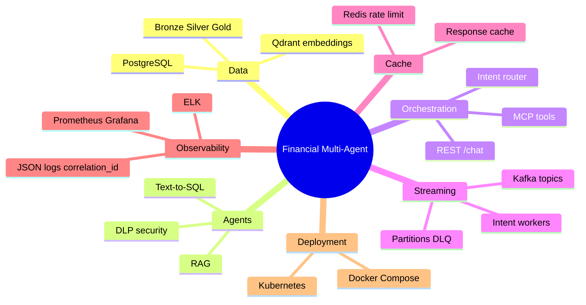

# Full Learning Plan — Financial Multi-Agent System

Complete study path from zero to production-style understanding.  
**Estimated time:** 10–12 weeks at ~5–8 hours/week.

---

## How to Use This Plan

1. Follow weeks in order — later topics build on earlier ones.
2. Check off items in [BUILD_CHECKLIST.md](BUILD_CHECKLIST.md) as you go.
3. Use [FILE_GUIDE.md](FILE_GUIDE.md) when you don't know what a file does.
4. Use topic guides: [KAFKA_GUIDE.md](KAFKA_GUIDE.md), [MCP_GUIDE.md](MCP_GUIDE.md), [ARCHITECTURE.md](ARCHITECTURE.md).

---

## System Map (What You Will Learn)



---

## Week 1 — Environment & Data Foundation

**Goal:** Understand where data comes from and how it lands in Postgres/Qdrant.

| Day | Task | Files |
|-----|------|-------|
| 1 | Install Docker, Ollama, Python 3.11+ | README |
| 2 | Copy `.env.example` → `.env`, read config | `shared/config.py` |
| 3 | Run `generate_sample_data.py`, inspect parquet | `scripts/generate_sample_data.py`, `data/` |
| 4 | Read Gold schema + read-only role | `infra/postgres/init.sql` |
| 5 | Load Postgres + ingest embeddings | `scripts/load_to_postgres.py`, `scripts/ingest_embeddings.py` |

**Verify:**
```powershell
python scripts/verify_pipeline.py
```

**Concepts:** Medallion architecture (Bronze → Silver → Gold), synthetic data, ETL.

---

## Week 2 — Security & Single Agents

**Goal:** Run each agent in isolation and understand its API.

| Day | Task | Files |
|-----|------|-------|
| 1 | DLP regex masking | `shared/dlp.py`, `services/dlp_agent/main.py` |
| 2 | Text-to-SQL: NL → SQL → Postgres | `services/text_to_sql_agent/main.py` |
| 3 | RAG: embed → Qdrant → answer | `services/rag_agent/main.py` |
| 4 | Ollama fallbacks | `shared/llm_client.py` |
| 5 | FastAPI patterns (health, metrics) | `shared/fastapi_app.py` |

**Verify:**
```powershell
docker compose up -d postgres qdrant dlp-agent text-to-sql-agent rag-agent
curl -X POST http://localhost:8001/mask -H "Content-Type: application/json" -d "{\"text\":\"PAN ABCDE1234F\"}"
```

**Concepts:** PII detection, SELECT-only SQL, vector search, read-only DB roles.

---

## Week 3 — Orchestrator & Routing

**Goal:** Trace one `/chat` request through DLP and intent classification.

| Day | Task | Files |
|-----|------|-------|
| 1 | Correlation IDs + JSON logging | `shared/logging_setup.py` |
| 2 | Intent router (keywords + Ollama) | `services/orchestrator/router.py` |
| 3 | `/chat` lifecycle | `services/orchestrator/main.py` |
| 4 | Run `test_api.py` for all 4 intents | `scripts/test_api.py` |
| 5 | Trace with `X-Correlation-ID` in logs | docker compose logs |

**Concepts:** API gateway pattern, intent classification, structured logging.

---

## Week 4 — Kafka Event Streaming

**Goal:** Understand topics, partitions, workers, DLQ.

| Day | Task | Files |
|-----|------|-------|
| 1 | Topic layout + partitions | `shared/kafka_topics.py`, `scripts/init_kafka_topics.sh` |
| 2 | Producer/consumer + partition keys | `services/orchestrator/kafka_bus.py` |
| 3 | Intent workers + retries + DLQ | `shared/kafka_worker.py`, `services/workers/main.py` |
| 4 | Complete [KAFKA_GUIDE.md](KAFKA_GUIDE.md) labs 1–5 | docs |
| 5 | Scale workers: `--scale sql-worker=2` | docker compose |

**Verify:**
```powershell
curl http://localhost:8000/kafka/status
docker compose exec kafka kafka-topics --bootstrap-server localhost:9092 --describe
```

**Concepts:** Event-driven architecture, consumer groups, dead-letter queues, horizontal scaling.

---

## Week 5 — Redis Cache & Rate Limiting

**Goal:** See cache hits and rate limits in action.

| Day | Task | Files |
|-----|------|-------|
| 1 | Redis client design | `shared/redis_client.py` |
| 2 | Rate limiting on `/chat` | orchestrator + `X-Client-ID` |
| 3 | Response cache (SQL/RAG) | orchestrator + workers |
| 4 | Inspect Redis keys | `redis-cli KEYS "*"` |
| 5 | Tune TTL and limits in `.env` | `.env.example` |

**Verify:**
```powershell
curl http://localhost:8000/cache/status
# Same question twice → data.cache_hit: true
```

**Concepts:** Cache-aside pattern, sliding-window rate limits, graceful degradation.

---

## Week 6 — MCP (Model Context Protocol)

**Goal:** Expose agents as LLM tools; connect Cursor.

| Day | Task | Files |
|-----|------|-------|
| 1 | What is MCP? Read [MCP_GUIDE.md](MCP_GUIDE.md) | docs |
| 2 | MCP tools → HTTP handlers | `shared/mcp_handlers.py` |
| 3 | FastMCP server (tools/resources/prompts) | `services/mcp_server/server.py` |
| 4 | Run `mcp_client_demo.py` | `scripts/mcp_client_demo.py` |
| 5 | Configure Cursor with `.cursor/mcp.json` | `.cursor/mcp.json.example` |

**Verify:**
```powershell
pip install "mcp>=1.27,<2"
python scripts/mcp_client_demo.py
```

**Concepts:** Tool calling, resources for context, stdio vs HTTP transport, agent interoperability.

---

## Week 7 — Observability

**Goal:** Use metrics and logs to debug slow or failed requests.

| Day | Task | Files |
|-----|------|-------|
| 1 | Prometheus scrape config | `monitoring/prometheus/prometheus.yml` |
| 2 | Grafana dashboards | `monitoring/grafana/` |
| 3 | Logstash → Elasticsearch | `monitoring/logstash/` |
| 4 | Query metrics: latency, errors, DLQ | Prometheus UI |
| 5 | Full trace drill (see below) | all services |

**Key Prometheus queries:**
```promql
orchestrator_requests_total
kafka_worker_dlq_total
orchestrator_cache_hits_total
text_to_sql_latency_seconds
```

**Concepts:** RED metrics, correlation IDs, centralized logging.

---

## Week 8 — End-to-End Trace Mastery

**Goal:** Trace one request through every layer.

**The drill** (use correlation ID `master-trace-001`):

1. `POST /chat` with header `X-Correlation-ID: master-trace-001`
2. Logs: `docker compose logs | Select-String master-trace-001`
3. Kafka: watch intent topic + `agent.responses`
4. Redis: `req:state:master-trace-001`, cache keys
5. Postgres: SQL from `data.sql_result` in response
6. Qdrant: sources from `data.rag_result` (for RAG questions)
7. Prometheus: intent counter incremented
8. MCP: call same query via `mcp_financial_chat`

**You understand the system when you can explain all 8 steps.**

---

## Week 9 — Docker Compose Cloud

**Goal:** Deploy to a free cloud VM.

| Day | Task | Files |
|-----|------|-------|
| 1 | Read [CLOUD_DEPLOYMENT.md](CLOUD_DEPLOYMENT.md) | docs |
| 2 | Create Oracle/AWS VM | cloud console |
| 3 | `setup-ubuntu.sh` + `docker-compose.cloud.yml` | `deploy/vm/` |
| 4 | Open firewall, test public API | curl |
| 5 | Optional: Ollama on VM | ollama.com |

---

## Week 10 — Container Registry & CI

**Goal:** Build images and push to GHCR.

```powershell
./deploy/scripts/build-images.ps1
docker login ghcr.io
./deploy/scripts/push-images.ps1
```

Enable `.github/workflows/docker-publish.yml` on GitHub push.

---

## Week 11 — Kubernetes

**Goal:** Deploy to minikube with HPA and Ingress.

```powershell
minikube start --memory=8192
kubectl apply -k k8s/
kubectl get pods -n financial-agents
```

**Files:** `k8s/*`, `k8s/README.md`

---

## Week 12 — Managed Cloud (Optional)

**Goal:** Replace self-hosted Postgres/Redis with Neon/Upstash.

See [CLOUD_DEPLOYMENT.md](CLOUD_DEPLOYMENT.md) Tier 4.

---

## Week 13 — Capstone Projects (Pick One)

### Option A: New Agent
Add a `merchants` table + SQL agent support for merchant analytics.

### Option B: New MCP Tool
Add `mcp_transaction_summary(customer_id)` tool.

### Option C: Kafka Replay
Build a script to replay messages from `agent.requests.dlq`.

### Option D: Observability
Add `dlp_findings_total` metric labeled by finding type.

---

## Week 12 — Interview / Portfolio Prep

Document in your README or blog:

1. Architecture diagram (draw from [ARCHITECTURE.md](ARCHITECTURE.md))
2. Why intent-specific Kafka topics?
3. How DLP + read-only SQL prevent data leaks
4. MCP vs REST — when to use each
5. One trace story with correlation ID

---

## Quick Reference — All Technologies

| Tech | Port | Learn in week |
|------|------|---------------|
| Orchestrator | 8000 | 3 |
| DLP | 8001 | 2 |
| Text-to-SQL | 8002 | 2 |
| RAG | 8003 | 2 |
| SQL worker | 8011 | 4 |
| RAG worker | 8012 | 4 |
| DLP worker | 8013 | 4 |
| Fallback worker | 8014 | 4 |
| MCP server | 8020 | 6 |
| Kafka | 9092 | 4 |
| Redis | 6379 | 5 |
| Postgres | 5432 | 1 |
| Qdrant | 6333 | 1 |
| Prometheus | 9090 | 7 |
| Grafana | 3000 | 7 |
| Kibana | 5601 | 7 |

---

## Study File Order (Complete List)

```
 1. README.md
 2. docs/FULL_LEARNING_PLAN.md          ← you are here
 3. docs/FILE_GUIDE.md
 4. scripts/generate_sample_data.py
 5. infra/postgres/init.sql
 6. shared/dlp.py
 7. services/dlp_agent/main.py
 8. services/text_to_sql_agent/main.py
 9. services/rag_agent/main.py
10. shared/logging_setup.py
11. shared/fastapi_app.py
12. services/orchestrator/router.py
13. services/orchestrator/main.py
14. shared/kafka_topics.py
15. services/orchestrator/kafka_bus.py
16. shared/kafka_worker.py
17. services/workers/main.py
18. shared/redis_client.py
19. shared/mcp_handlers.py
20. services/mcp_server/server.py
21. docs/KAFKA_GUIDE.md
22. docs/MCP_GUIDE.md
23. docs/ARCHITECTURE.md
24. monitoring/
25. docker-compose.yml
26. k8s/
```

---

## Daily Habit (15 min)

Even on light days:

1. Send one `/chat` request
2. Read one log line with your `correlation_id`
3. Read 20 lines of one file from the list above

Consistency beats cramming.
