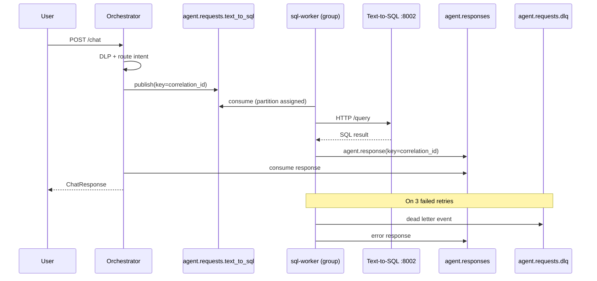

# Kafka Learning Guide

This project uses **production-style Kafka patterns** for learning: intent-based topics, partitions, partition keys, consumer groups, DLQ, and horizontal scaling.

## Topic Layout

| Topic | Partitions | Purpose | Consumer group |
|-------|------------|---------|----------------|
| `agent.requests.text_to_sql` | 3 | Transaction / SQL queries | `sql-worker-group` |
| `agent.requests.faq_rag` | 3 | Policy / FAQ questions | `rag-worker-group` |
| `agent.requests.dlp_only` | 2 | PII masking requests | `dlp-worker-group` |
| `agent.requests.fallback` | 1 | Greetings / ambiguous | `fallback-worker-group` |
| `agent.responses` | 6 | All worker replies → orchestrator | unique per orchestrator instance |
| `agent.requests.dlq` | 1 | Failed messages after retries | (manual inspection) |

Topics are created explicitly by `scripts/init_kafka_topics.sh` (run via `kafka-init` in Docker Compose). Auto-create is **disabled** so you learn explicit topic design.

## End-to-End Flow



## Partition Keys

Every publish uses **`correlation_id` as the partition key**:

- Same user's related messages land on the same partition (ordering per conversation)
- Response events use the same key so orchestrator routing is predictable

Code: `services/orchestrator/kafka_bus.py` → `publish(topic, event, key=cid)`

## Consumer Groups & Scaling

Multiple replicas of the **same worker** share a consumer group. Kafka assigns partitions across replicas.

```powershell
# Run 2 SQL workers — they share partitions 0,1,2 on agent.requests.text_to_sql
docker compose up -d --scale sql-worker=2
```

Rules:
- **Max parallel consumers per topic = partition count** (extra consumers sit idle)
- SQL topic has 3 partitions → up to 3 `sql-worker` instances process in parallel
- RAG topic has 3 partitions → up to 3 `rag-worker` instances
- Fallback has 1 partition → only 1 consumer active at a time

## Dead-Letter Queue (DLQ)

`shared/kafka_worker.py` retries each message **3 times** (`KAFKA_MAX_RETRIES`). On final failure:

1. Event published to `agent.requests.dlq` with error metadata
2. Error response published to `agent.responses` (orchestrator still gets a reply)
3. Metric `kafka_worker_dlq_total` increments

### Inspect DLQ

```powershell
docker compose exec kafka kafka-console-consumer `
  --bootstrap-server localhost:9092 `
  --topic agent.requests.dlq `
  --from-beginning
```

## Intent Routing

The orchestrator does **not** send all intents to one topic. After `classify_intent()`:

```python
intent_topic = topic_for_intent(intent.value)  # shared/kafka_topics.py
await kafka_bus.publish(intent_topic, event, key=correlation_id)
```

| Intent | Topic |
|--------|-------|
| `text_to_sql` | `agent.requests.text_to_sql` |
| `faq_rag` | `agent.requests.faq_rag` |
| `dlp_only` | `agent.requests.dlp_only` |
| `fallback` | `agent.requests.fallback` |

## Hands-On Labs

### Lab 1: List topics and partitions

```powershell
docker compose exec kafka kafka-topics --bootstrap-server localhost:9092 --describe
```

### Lab 2: Watch intent-specific traffic

```powershell
# Terminal 1 — SQL requests only
docker compose exec kafka kafka-console-consumer `
  --bootstrap-server localhost:9092 `
  --topic agent.requests.text_to_sql `
  --from-beginning

# Terminal 2 — send SQL chat
curl -X POST http://localhost:8000/chat -H "Content-Type: application/json" `
  -d "{\"message\": \"Show my last 5 transactions\"}"
```

### Lab 3: Trace correlation ID across topics

```powershell
curl -X POST http://localhost:8000/chat `
  -H "Content-Type: application/json" `
  -H "X-Correlation-ID: kafka-lab-001" `
  -d "{\"message\": \"What is the NEFT limit?\"}"

docker compose logs -f | Select-String "kafka-lab-001"
```

### Lab 4: Scale SQL workers

```powershell
docker compose up -d --scale sql-worker=2
docker compose exec kafka kafka-consumer-groups `
  --bootstrap-server localhost:9092 `
  --describe --group sql-worker-group
```

### Lab 5: Kafka status API

```powershell
curl http://localhost:8000/kafka/status
```

## Key Files

| File | Role |
|------|------|
| `shared/kafka_topics.py` | Topic names, partitions, intent mapping |
| `services/orchestrator/kafka_bus.py` | Producer/consumer with partition keys |
| `shared/kafka_worker.py` | Retries, DLQ, agent HTTP calls |
| `services/workers/main.py` | Per-intent worker container |
| `scripts/init_kafka_topics.sh` | Topic creation script |

## Metrics

Prometheus queries:

```promql
kafka_worker_processed_total
kafka_worker_dlq_total
orchestrator_kafka_timeouts_total
```

## Common Interview Questions

**Why separate topics per intent?**  
Isolate workloads — slow RAG doesn't block fast SQL; scale each independently.

**Why partition keys?**  
Ordering and affinity — all events for one `correlation_id` go to the same partition.

**Why DLQ?**  
Poison messages don't block the consumer forever; ops can inspect and replay.

**Why disable auto-create?**  
Forces explicit partition/replication design — production best practice.
