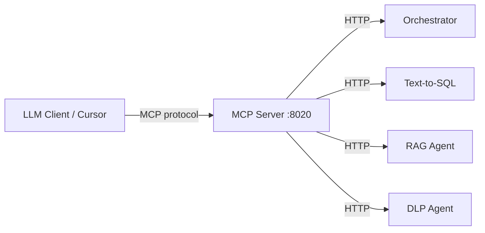

# MCP (Model Context Protocol) Learning Guide

MCP is how **LLM clients** (Cursor, Claude Desktop, custom agents) connect to **tools, resources, and prompts** exposed by your backend — without hard-coding HTTP calls in the chat UI.

This project now includes a real MCP server that wraps your existing microservices.

## What MCP Adds to This Project

| MCP concept | In this repo | Maps to |
|-------------|--------------|---------|
| **Tools** | Callable functions for LLMs | DLP, SQL, RAG, orchestrator HTTP APIs |
| **Resources** | Read-only context (schema, docs) | `init.sql`, FAQ index, Kafka topic map |
| **Prompts** | Reusable prompt templates | Spending analysis, policy review, DLP workflow |
| **Transport (stdio)** | Cursor / Claude Desktop | `services/mcp_server/run_stdio.py` |
| **Transport (HTTP)** | MCP Inspector, remote clients | Docker `mcp-server` on port **8020** |



## Files to Study

| File | Purpose |
|------|---------|
| `services/mcp_server/server.py` | Tools, resources, prompts (FastMCP) |
| `services/mcp_server/run_stdio.py` | Stdio entry for Cursor |
| `shared/mcp_handlers.py` | HTTP bridge to microservices |
| `scripts/mcp_client_demo.py` | Minimal MCP **client** (learning) |
| `.cursor/mcp.json.example` | Cursor configuration template |

## MCP Tools Exposed

| Tool | When to use |
|------|-------------|
| `mcp_query_transactions` | Natural language → SQL → Postgres |
| `mcp_ask_policy` | FAQ / policy questions via RAG |
| `mcp_mask_sensitive_text` | Mask PAN, email, phone before processing |
| `mcp_financial_chat` | Full pipeline (DLP → router → Kafka → agents) |
| `mcp_agents_health` | Check if agents are reachable |

## MCP Resources

| URI | Content |
|-----|---------|
| `schema://gold/postgresql` | Full `infra/postgres/init.sql` |
| `docs://faq/index` | List of RAG document files |
| `config://kafka/topics` | Intent topics + partition counts |

## MCP Prompts

| Prompt | Use case |
|--------|----------|
| `Analyze Spending` | Template for category spend analysis |
| `Policy Review` | Template for policy Q&A |
| `Safe PII Handling` | DLP-first workflow reminder |

---

## Lab 1: Connect MCP in Cursor

1. Start the stack:
   ```powershell
   docker compose up -d postgres qdrant dlp-agent text-to-sql-agent rag-agent orchestrator
   docker compose --profile init run --rm data-init
   ```

2. Install MCP locally:
   ```powershell
   pip install "mcp>=1.27,<2"
   ```

3. Copy MCP config:
   ```powershell
   copy .cursor\mcp.json.example .cursor\mcp.json
   ```
   Edit `cwd` in `.cursor/mcp.json` to your project path.

4. In Cursor: **Settings → MCP** — enable `financial-multi-agent`.

5. In chat, ask Cursor to use `mcp_agents_health` or `mcp_query_transactions`.

---

## Lab 2: Run MCP Client Demo (stdio)

```powershell
pip install "mcp>=1.27,<2" httpx pydantic-settings
python scripts/mcp_client_demo.py
```

You should see listed tools, resources, prompts, and a health check result.

---

## Lab 3: Streamable HTTP (Docker)

```powershell
docker compose up -d mcp-server
```

MCP server listens on **http://localhost:8020** (Streamable HTTP transport).

Test with [MCP Inspector](https://modelcontextprotocol.io/docs/tools/inspector) pointing at your HTTP endpoint.

---

## Lab 4: Trace MCP → Microservice

1. Call `mcp_financial_chat` with message `"Show my last 3 transactions"`.
2. MCP server → orchestrator `POST /chat`.
3. Trace with correlation ID from response:
   ```powershell
   docker compose logs orchestrator sql-worker | Select-String "correlation_id_value"
   ```

---

## Lab 5: Build Your Own Tool (Exercise)

Add a new tool in `services/mcp_server/server.py`:

```python
@mcp.tool()
async def mcp_kafka_status() -> str:
    """Return orchestrator Kafka topic configuration."""
    async with httpx.AsyncClient() as client:
        resp = await client.get(f"{settings.orchestrator_url}/kafka/status")
        return resp.text
```

Restart MCP server and verify with `mcp_client_demo.py` or Cursor.

---

## MCP vs REST in This Project

| | REST (`/chat`) | MCP |
|--|----------------|-----|
| Caller | Your app, curl, test scripts | LLM clients (Cursor, agents) |
| Discovery | OpenAPI / docs | `list_tools`, `list_resources` |
| Context | You pass everything | Resources auto-injected |
| Learning value | API design | Agent tool-use patterns |

Both call the **same microservices** — MCP is an adapter layer for AI clients.

---

## Further Reading

- MCP spec: https://modelcontextprotocol.io
- Python SDK: https://github.com/modelcontextprotocol/python-sdk
- Cursor MCP docs: https://docs.cursor.com/context/mcp
